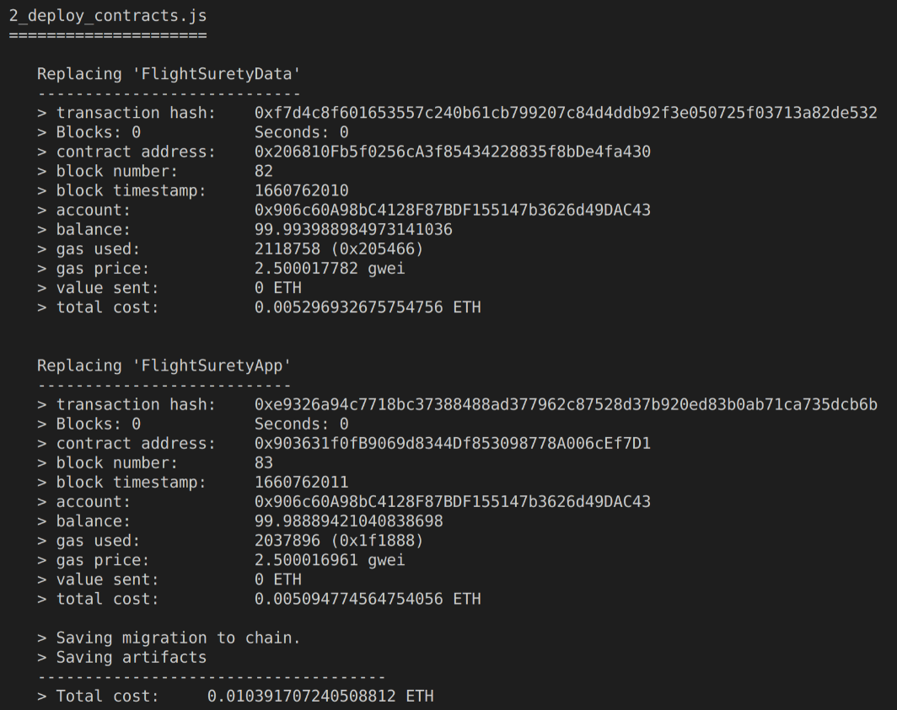
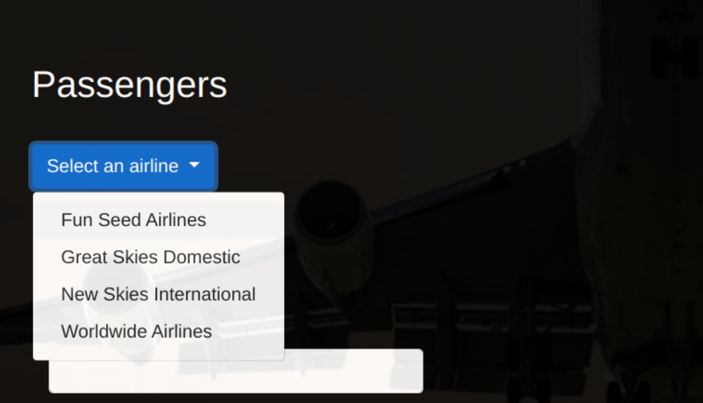

# FlightSurety
# Frameworks and libraries versions:
Truffle v5.5.21 (core: 5.5.21)

Ganache v7.2.0

Solidity - ^0.4.24 (solc-js)

Web3.js v1.7.4

Node v12.0.0

To install packages the following commands were required since NPM got stuck in oboe package, and verbose was used to diagnose any issue during the installation:

npm i oboe@2.1.3
npm install --verbose

Once node packages are installed, to execute the Dapp the following steps are required:

1. run truffle develop to create the development local blockchain environment.
2. Replace the accounts and security phrase in flightSurety.js.
3. Compile the contracts with 'compile' command.
4. Publish the contracts with 'migrate --reset'.
5. Execute tests, which also initialize state with 'test'.
6. Open a new terminal and execute 'npm run dapp'.
7. Open Metamask and import accounts 0, 1 and 8 to review balances and track    transactions.
8. Browse the Dapp web app at 'http://localhost:8000/'.
9. Open a third terminal and execute 'npm run server'.
10. In the Web app operate the buttons and values from top to bottom flow.

The following are screen shots of my local environment consoles and Web app:
## Truffle dev environment:

## Contracts migrated to local network with their addresses:

## Tests results:

## Dapp webpack complilation and execution, listening on por 8000:

## Server execution with tradicional node since webpack produced issues:

## Web app UI:

## Airline selection:

## Airline selected:

## Buy insurace:

## Check and claim credit:

## Change flight status for oracles:

FlightSurety is a sample application project for Udacity's Blockchain course.

## Install

This repository contains Smart Contract code in Solidity (using Truffle), tests (also using Truffle), dApp scaffolding (using HTML, CSS and JS) and server app scaffolding.

To install, download or clone the repo, then:

`npm install`
`truffle compile`

## Develop Client

To run truffle tests:

`truffle test ./test/flightSurety.js`
`truffle test ./test/oracles.js`

To use the dapp:

`truffle migrate`
`npm run dapp`

To view dapp:

`http://localhost:8000`

## Develop Server

`npm run server`
`truffle test ./test/oracles.js`

## Deploy

To build dapp for prod:
`npm run dapp:prod`

Deploy the contents of the ./dapp folder

## Resources

* [How does Ethereum work anyway?](https://medium.com/@preethikasireddy/how-does-ethereum-work-anyway-22d1df506369)
* [BIP39 Mnemonic Generator](https://iancoleman.io/bip39/)
* [Truffle Framework](http://truffleframework.com/)
* [Ganache Local Blockchain](http://truffleframework.com/ganache/)
* [Remix Solidity IDE](https://remix.ethereum.org/)
* [Solidity Language Reference](http://solidity.readthedocs.io/en/v0.4.24/)
* [Ethereum Blockchain Explorer](https://etherscan.io/)
* [Web3Js Reference](https://github.com/ethereum/wiki/wiki/JavaScript-API)